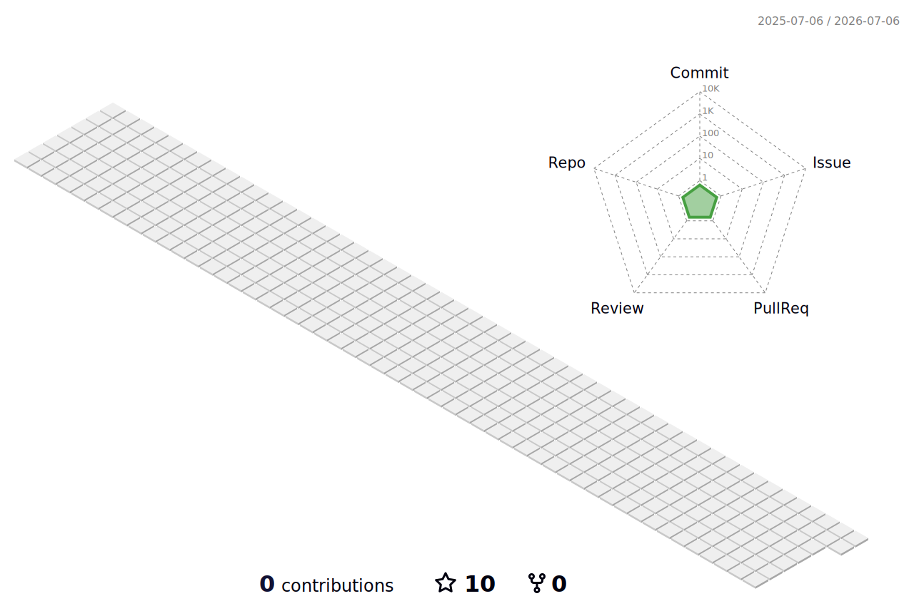

<div align="center">


<p>
  <a href="https://github.com/yuanzhechn"></a>
  <a href="https://github.com/yuanzhechn?tab=followers"></a>
  <a href="https://github.com/yuanzhechn?tab=repositories"></a>
  <a href="mailto:yuanzhechn@foxmail.com"></a>
</p>

<p>
  
  
</p>

<a href="https://git.io/typing-svg">
  
</a>

<br />
<br />


</div>

## System Profile

```yaml
name: Yuan Zhe
github: yuanzhechn
email: yuanzhechn@foxmail.com
location: China
mode: building
interests:
  - full-stack development
  - AI-assisted engineering
  - automation
  - practical open source
values:
  - ship useful things
  - keep learning
  - make software feel good
```

## Arsenal

| Property | Stack |
| --- | --- |
| Languages |      |
| Frontend |      |
| Backend |     |
| Tools |     |
| Current Focus |    |

## GitHub Command Center

<div align="center">


<br />
<br />


<br />
<br />


</div>

## Green Wall

<div align="center">


<br />
<br />



</div>

## Profile Summary

<div align="center">


<br />
<br />


</div>

## Connect

<p align="center">
  <a href="mailto:yuanzhechn@foxmail.com"></a>
  <a href="https://github.com/yuanzhechn"></a>
</p>

<div align="center">
<br />
<br />


</div>


