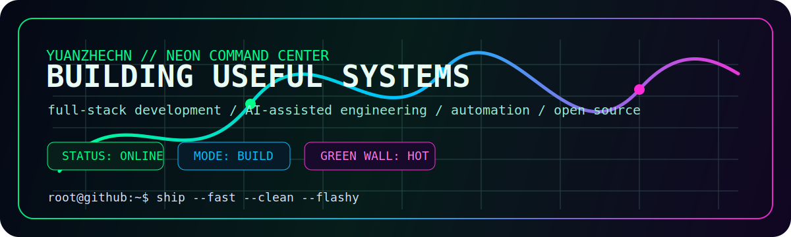
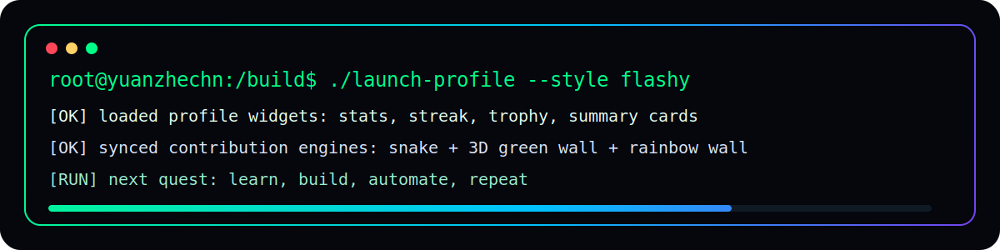
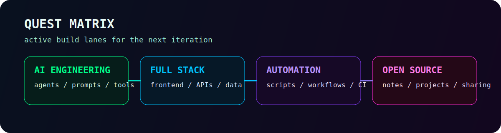
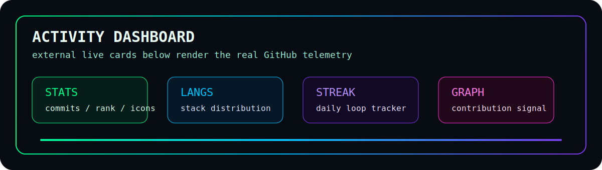
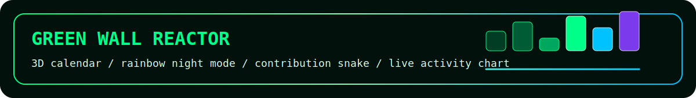
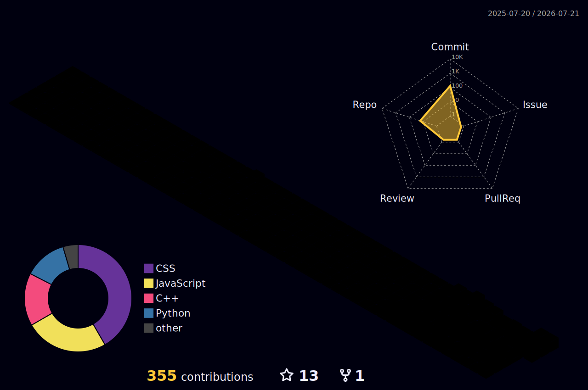
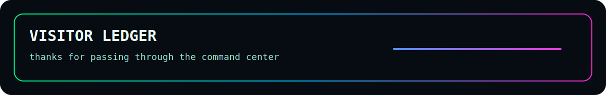

<!-- yuanzhechn profile README: local neon command-center theme inspired by stable RPG profile layouts. -->

  

  
   
  

  

<table>
  <tr>
    <td width="50%" valign="top">
      <h2>Character Sheet</h2>
      <table>
        <tr><td><b>Callsign</b></td><td>Yuan Zhe / yuanzhechn</td></tr>
        <tr><td><b>Spawn Point</b></td><td>China</td></tr>
        <tr><td><b>Class</b></td><td>Full-stack builder, automation learner</td></tr>
        <tr><td><b>Current Mode</b></td><td>Learning, building, shipping</td></tr>
        <tr><td><b>Contact</b></td><td>yuanzhechn@foxmail.com</td></tr>
      </table>
    </td>
    <td width="50%" valign="top">
      <h2>Current Build</h2>
      <ul>
        <li>AI-assisted development workflows</li>
        <li>Frontend interfaces and practical tools</li>
        <li>Backend APIs, data, and automation</li>
        <li>Readable code and reusable experiments</li>
      </ul>
    </td>
  </tr>
</table>

  

## Quest Matrix

  

## Activity Dashboard

  

  
  
   
   
  
   
   
  

## Arsenal

  

| Slot | Loadout |
| --- | --- |
| Languages / IDE |      |
| Frontend |      |
| Backend / Data |     |
| Tools / Platform |     |
| Current Focus |    |

## Contribution Arcade

  

  

  

  <picture>
    <source media="(prefers-color-scheme: dark)" srcset="https://raw.githubusercontent.com/yuanzhechn/yuanzhechn/output/github-contribution-grid-snake-dark.svg" />
    <source media="(prefers-color-scheme: light)" srcset="https://raw.githubusercontent.com/yuanzhechn/yuanzhechn/output/github-contribution-grid-snake.svg" />
    
  </picture>

## Trophy Room

  

## Metrics Console

  
Profile summary cards

  
   
   
  
  
  

## Visitor Ledger

  
   
  

  
  
  

  

